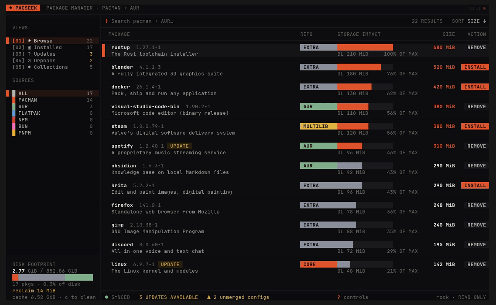

<div align="center">

# ◆ PacSeek

**A tech-brutalist TUI package manager for Arch Linux.**

The one that judges your disk usage - `pacman` (core · extra · multilib), the
**AUR**, and **flatpak**, in one keyboard-driven terminal, with zero mercy for
that 4 GiB you forgot you installed.




</div>

## What it is

Most package front-ends will happily install a 700 MiB toolchain without so much
as a raised eyebrow. PacSeek raises the eyebrow. It treats **disk usage as the
headline metric**: every package wears a storage-impact bar normalized to the
heaviest thing in view, and the sidebar carries a live **disk-footprint card** that
puts your installed total against your whole drive, broken down by repository color.

It reads real data straight from pacman's own **libalpm** - no shelling out, no
scraping CLI output - and dresses it in a Braun-inspired brutalist skin: square
corners, machined chrome, a single orange accent, and mono data type.

## Highlights

- **Storage-first, and it means it.** Per-package impact bars, heavy-package
  highlighting (anything ≥ 300 MiB turns orange), a repo-segmented disk-footprint
  card, and an orphans view that tells you exactly how much space you'd reclaim.
- **Real data, no scraping.** Links libalpm directly - the local database joined
  against the sync databases, with foreign / hand-built packages surfaced as AUR,
  plus live AUR RPC search and flatpak apps folded into the same catalog.
- **Built for big systems.** The package list is virtualized: it renders only the
  rows that fit your terminal, so a full 15,000-package catalog scrolls instantly.
- **Safe by default.** A partial-upgrade guard, a removal-cascade preview, and an
  honest sync-age footer catch the hazards the raw commands don't flag - and
  nothing touches your system until you confirm at the real prompts.
- **Keyboard-driven, yours to rebind.** Views, search, sort, detail, and batches
  are all a keystroke away, every letter binding is configurable, and your config
  folder carries your themes, collections, and muscle memory to a fresh machine.

## Quick start

```sh
curl -fsSL https://codeberg.org/m1stD3V/pacseek/raw/branch/main/get.sh | sh
```

That builds the latest tagged release from source and installs it to `~/.local`
- no root, nothing left behind but the binary. Pass options through with
`sh -s --`:

```sh
curl -fsSL .../get.sh | sh -s -- --system        # install to /usr/local (sudo)
curl -fsSL .../get.sh | sh -s -- --prefix ~/opt  # custom prefix
curl -fsSL .../get.sh | sh -s -- --ref main      # build the tip of main
curl -fsSL .../get.sh | sh -s -- --help          # every option
```

Piping a script into a shell is a trust decision, so
[read it first](get.sh) if you'd rather - it's short, and it does exactly what
the clone-and-build below does.

<details>
<summary>Already cloned the repo?</summary>

```sh
./install.sh                 # build + install to ~/.local (no root)
./install.sh --system        # build + install to /usr/local (uses sudo)
./install.sh --help          # prefix / build-dir / jobs options
```

</details>

Either way the installer verifies the toolchain, does a Release build, installs,
and - if the install dir isn't on your `PATH` - prints the exact line to add for
your shell.

Then run it:

```sh
pacseek            # live system, via libalpm
pacseek --mock     # the 22-package design prototype (offline, read-only)
pacseek --help
```

Kicking the tires? `--mock` is a self-contained dataset that touches nothing -
it's the same thing you see in the GIF above.

<details>
<summary>Build it by hand instead</summary>

```sh
cmake -S . -B build -DCMAKE_BUILD_TYPE=Release
cmake --build build -j
ctest --test-dir build --output-on-failure   # optional: run the test suite
cmake --install build --prefix ~/.local       # drops the binary at ~/.local/bin/pacseek
```

**Requirements:** a C++17 compiler (GCC or Clang), CMake ≥ 3.20, `libalpm`
(pacman's own library - you already have it), and `libcurl` for AUR search.
`nlohmann-json` is optional and auto-detected; FTXUI is fetched and pinned
automatically by CMake (v6.1.9).

</details>

## Usage at a glance

Two axes. **Views** - Browse · Installed · Updates · Orphans · Collections - on
number keys `1`–`5`, and **Sources** - All · pacman · AUR · flatpak · npm · … -
cycled with `f` (or clicked). Pick a view, optionally narrow it to one ecosystem.
`/` searches, `s` sorts by size or name, `d` opens a package's detail pane, `space`
marks a batch, `enter` applies. Lost? Press `?` for the full keymap.

That's the tour. The full manual lives in the docs:

| Document | What's in it |
|----------|--------------|
| [**docs/USAGE.md**](docs/USAGE.md) | Every key, every view, the detail pane, transactions, safety prompts, batches, and the flatpak/AUR machinery |
| [**docs/CONFIGURATION.md**](docs/CONFIGURATION.md) | `config.ini`, themes, custom keybindings, portable package lists, and user-defined collections |
| [**docs/ARCHITECTURE.md**](docs/ARCHITECTURE.md) | The layered design, the data-source interface, list virtualization, and the design-token system |
| [**CHANGELOG.md**](CHANGELOG.md) | Everything that's built, and the features deliberately left on the cutting-room floor |

## Status

**Feature-complete for 1.0** - a sentence every developer has said and PacSeek
actually means. Browse, search, live sizes, update detection, real transactions
(pacman, AUR helpers, and flatpak), the detail pane, orphan cleanup, and the whole
disk-footprint story are live. There's a `pacseek.1` man page, a CTest suite under
Woodpecker CI, and a `PKGBUILD` in [`packaging/`](packaging/) waiting on a release
tag. See the [changelog](CHANGELOG.md) for the full ledger.

## License

Released under the [MIT License](LICENSE).

---

<div align="center">

Created by **m1st** · built to make you feel bad about `texlive`

</div>
