<div align="center">

# ◆ PacSeek

**A tech-brutalist TUI package manager for Arch Linux — where storage impact is a first-class citizen.**

`pacman` repositories (core · extra · multilib) and the **AUR**, in one keyboard-driven terminal interface.


</div>

---

## What it is

PacSeek is a terminal program for browsing the packages on your Arch system and in
its repositories. Unlike most package front-ends, it treats **disk usage as the
headline metric**: every package shows a storage-impact bar normalized to the
heaviest package in view, and the sidebar carries a live **disk-footprint card**
that puts your installed total against your whole drive, broken down by repository
color.

It reads real data straight from pacman's own **libalpm** — no shelling out, no
scraping CLI output — and recreates the `design_handoff_pacseek` visual reference
in the terminal: square corners, machined chrome, a single Braun-orange accent,
and mono data type.

> A captured frame lives in [`docs/preview.txt`](docs/preview.txt). Colors are lost
> in plain text — run it for the real thing.

```
 ◆ PACSEEK   PACKAGE MANAGER · PACMAN + AUR                                   ▢ ▢ ▣
──────────────────────────────┬─────────────────────────────────────────────────────
                              │ ❯ Search pacman + AUR…                22 RESULTS  SORT SIZE ↓
  LIBRARY                     ├─────────────────────────────────────────────────────────
                              │  PACKAGE                       REPO     STORAGE IMPACT      SIZE    ACTION
  ◈ Browse                22 ├─────────────────────────────────────────────────────────
  ▣ Installed             17 │ rustup  1.27.1-1               EXTRA    ██████████████     680 MiB  REMOVE
  ↑ Updates                3  │ The Rust toolchain installer            DL 210 MiB  100% OF MAX
  ✦ AUR                    3  ├─────────────────────────────────────────────────────────
                              │ blender  4.1.1-3               EXTRA    ██████████░░░░     520 MiB  INSTALL
  REPOSITORIES                │ A fully integrated 3D suite             DL 180 MiB   76% OF MAX
  █ CORE                   2  │ …
  █ EXTRA                 12  │
  █ AUR                    3  │
  █ MULTILIB               0  │
──────────────────────────────┤
  DISK FOOTPRINT              │
  24.56 GiB / 852.86 GiB      │   ← installed total / whole-drive capacity
  ██████░░░░░░░░░░░░░░░░      │   ← segmented by repository color
  1365 packages · 2.9% of disk│
```

## Highlights

- **Storage-first by design.** Per-package impact bars, heavy-package highlighting
  (anything ≥ 300 MiB turns orange), and a repo-segmented disk-footprint summary.
- **Real data, no scraping.** Links libalpm directly: the local database (what's
  installed) joined against the sync databases (what's available, sizes, newer
  versions), with foreign / hand-built packages surfaced as AUR.
- **Built for big systems.** The package list is virtualized — it renders only the
  rows that fit your terminal, so a full 15,000-package catalog scrolls instantly.
- **Two interchangeable backends.** The live libalpm source and a self-contained
  22-package mock dataset share one interface; the UI never knows the difference.
- **Keyboard-driven.** Views, search, sort, and navigation are all a keystroke away.
- **A single design language.** Every color, threshold, and column width lives in
  one theme file — no hardcoded values scattered through the render layer.

## Status

**Read-only browse.** Search, listing, sizes, update detection, and the disk
footprint are all live from libalpm. `INSTALL` / `REMOVE` buttons render but are
**informational only** — applying transactions (with privilege escalation) and live
AUR RPC search are the next milestones. See [Roadmap](#roadmap).

---

## Install

### Requirements

| Dependency | Notes |
|------------|-------|
| C++17 compiler | GCC or Clang |
| CMake ≥ 3.20 | build system |
| `libalpm` | pacman's library — present on every Arch system |
| `libcurl` | for forthcoming AUR networking |
| `nlohmann-json` | optional; auto-detected |
| FTXUI | **fetched and pinned automatically** by CMake (v6.1.9) |

### Build

```sh
cmake -S . -B build -DCMAKE_BUILD_TYPE=Release
cmake --build build -j
```

### Run

```sh
./build/pacseek          # live system, via libalpm
./build/pacseek --mock   # the design prototype's 22-package dataset (offline)
./build/pacseek --help
```

### Install to your PATH

```sh
cmake --install build --prefix ~/.local
```

This drops the binary at `~/.local/bin/pacseek`. If `~/.local/bin` is on your
`PATH`, you can now run `pacseek` from anywhere. For a system-wide install, omit
`--prefix` (defaults to `/usr/local`, needs root).

---

## Usage

### Keys

| Key | Action |
|-----|--------|
| `1` – `4` | switch view — Browse / Installed / Updates / AUR |
| `/` | focus search (`Esc` or `Enter` to leave) |
| `j` / `k` | move selection (also `↓` / `↑`) |
| `s` | toggle sort — size ↓ / name ↓ |
| `enter` / `space` | act on selection (read-only notice for now) |
| `q` / `esc` | quit |

### Views

- **Browse** — everything in the sync repositories.
- **Installed** — only what's currently on the system.
- **Updates** — packages whose installed version is older than the sync version.
- **AUR** — foreign packages (AUR or hand-built), surfaced from the local database.

Search filters the active view by a case-insensitive match over package **name and
description**. The nav counts always reflect the whole dataset, independent of the
current search.

### Reading the storage impact

- **Impact bar** — each package's installed size as a fraction of the heaviest
  package currently in view, so bars stay comparable as you sort and filter.
- **Heavy highlight** — packages at or above **300 MiB** render their size and bar
  in the orange accent.
- **`% OF MAX`** — the same fraction as a number, alongside the compressed
  **download** size.

### The disk-footprint card

Pinned to the foot of the sidebar:

```
  DISK FOOTPRINT
  24.56 GiB / 852.86 GiB        installed total / total drive capacity
  ██████░░░░░░░░░░░░░░░░         repo breakdown: CORE · EXTRA · AUR · MULTILIB
  1365 packages · 2.9% of disk   share of the whole filesystem
```

Drive capacity is measured once at startup from the root filesystem. The segmented
bar uses each repository's identity color, so you can see at a glance which sources
own your disk.

---

## Architecture

The codebase is layered so that each concern is isolated and testable, with the
render layer kept free of I/O and the data layer kept free of presentation. The
dependency direction is strict and one-way — solid arrows are calls / ownership,
dashed arrows are interface implementations and design-token lookups.

```mermaid
flowchart TD
    CLI([" terminal · keystrokes "]):::ext

    subgraph entry [" "]
        MAIN["main.cpp<br/><i>flags · source selection</i>"]:::app
    end

    subgraph applayer ["app · owns state and the loop"]
        APP["App<br/><i>event loop · key bindings</i>"]:::app
        STATE["AppState<br/><i>view · query · sort · selection</i>"]:::app
    end

    subgraph uilayer ["ui · pure state to Element"]
        RENDER["RenderApp<br/><i>brutalist render builders</i>"]:::ui
        VLIST["PackageList<br/><i>virtualized window</i>"]:::ui
    end

    subgraph datalayer ["data · where packages come from"]
        PSRC{{"PackageSource<br/><i>interface</i>"}}:::data
        ALPM["AlpmSource<br/><i>live</i>"]:::data
        MOCK["MockSource<br/><i>offline</i>"]:::data
    end

    subgraph modellayer ["model · pure logic, no I/O"]
        CAT["Catalog<br/><i>filter · sort · counts · footprint</i>"]:::model
        PKG["Package"]:::model
    end

    THEME["theme.hpp<br/><i>every design token, named</i>"]:::theme
    LIBALPM[("libalpm<br/>pacman DBs")]:::ext

    CLI -->|input| APP
    MAIN -->|selects| PSRC
    MAIN -->|runs| APP

    APP -->|mutates| STATE
    APP -->|owns| CAT
    APP -->|draws via| RENDER
    APP -->|loads once| PSRC

    RENDER -->|reads| STATE
    RENDER -->|queries| CAT
    RENDER --> VLIST

    PSRC -.implemented by.-> ALPM
    PSRC -.implemented by.-> MOCK
    ALPM -->|reads| LIBALPM
    ALPM -->|produces| PKG
    MOCK -->|produces| PKG
    CAT -->|owns| PKG

    RENDER -.tokens.-> THEME
    CAT -.tokens.-> THEME
    PKG -.tokens.-> THEME

    classDef app fill:#24160f,stroke:#de542c,stroke-width:2px,color:#e9e7e2
    classDef ui fill:#15151a,stroke:#8a8f9a,stroke-width:1.5px,color:#e9e7e2
    classDef data fill:#13201a,stroke:#7fae8b,stroke-width:1.5px,color:#e9e7e2
    classDef model fill:#1a1a1d,stroke:#b8b6b0,stroke-width:1.5px,color:#e9e7e2
    classDef theme fill:#2a2210,stroke:#e0b341,stroke-width:1.5px,color:#e9e7e2
    classDef ext fill:#0b0b0d,stroke:#5d5d5a,stroke-width:1px,color:#9a9a95,stroke-dasharray:4 3

    style entry fill:#0e0e10,stroke:#1c1c20
    style applayer fill:#0e0e10,stroke:#1c1c20,color:#5d5d5a
    style uilayer fill:#0e0e10,stroke:#1c1c20,color:#5d5d5a
    style datalayer fill:#0e0e10,stroke:#1c1c20,color:#5d5d5a
    style modellayer fill:#0e0e10,stroke:#1c1c20,color:#5d5d5a
```



The file map:

```
src/
  theme.hpp            every design token — colors, the 300 MiB "heavy"
                       threshold, the GiB / TiB cutoffs, column widths — as
                       named constants. No magic numbers downstream.
  model/               pure domain logic, no I/O (fully testable)
    package.{hpp,cpp}    Package type, repo ↔ color/name, size formatting
    catalog.{hpp,cpp}    filtering / search / sort, view + repo counts,
                         disk-footprint totals
  data/                where packages come from, behind one interface
    package_source.hpp   abstract PackageSource
    mock_source.{hpp,cpp}  the prototype's fixed 22-package dataset (--mock)
    alpm_source.{hpp,cpp}  libalpm: local DB joined against sync DBs, with
                           update detection; foreign packages shown as AUR
  ui/
    components.{hpp,cpp} the brutalist render layer — pure state → Element
                         builders, including the virtualized package list
  app/
    app_state.hpp        the mutable UI state (view / query / sort / selection)
    app.{hpp,cpp}        run loop, key bindings, state transitions
  main.cpp             flag parsing + source selection
```

The UI never knows which `PackageSource` it is drawing, so `--mock` and the live
libalpm backend are fully interchangeable. For a deeper tour — data flow, the
rendering model, and the list-virtualization design — see
[`docs/ARCHITECTURE.md`](docs/ARCHITECTURE.md).

## Design system

The visual language is a single Braun-inspired accent over near-black surfaces,
with repository identity colors doing the categorical work.

| Token | Hex | Role |
|-------|-----|------|
| Accent | `#de542c` | Braun orange — brand, heavy packages, active nav |
| Repo · core | `#de542c` | orange |
| Repo · extra | `#8a8f9a` | grey |
| Repo · aur | `#7fae8b` | sage |
| Repo · multilib | `#e0b341` | amber |
| Text | `#e9e7e2` | primary type |

Thresholds and dimensions live alongside the palette in
[`src/theme.hpp`](src/theme.hpp): the 300 MiB heavy cutoff, the 1024 MiB → GiB and
1024 GiB → TiB formatting steps, and every column width.

## Roadmap

- [x] Read-only browse with live sizes, update detection, and disk footprint
- [x] Virtualized package list (handles full catalogs smoothly)
- [x] Disk footprint against total drive capacity
- [ ] Apply transactions (install / remove) with privilege escalation
- [ ] Live AUR RPC search
- [ ] Per-package detail pane (dependencies, files, provenance)

---

<div align="center">

Created by **m1st**

</div>
