<div align="center">

# ◆ PacSeek

**A tech-brutalist TUI package manager for Arch Linux, where storage impact is a first-class citizen.**

`pacman` repositories (core · extra · multilib) and the **AUR**, in one keyboard-driven terminal interface.


</div>

---

## What it is

PacSeek is a terminal program for browsing the packages on your Arch system and in
its repositories. Unlike most package front-ends, it treats **disk usage as the
headline metric**: every package shows a storage-impact bar normalized to the
heaviest package in view, and the sidebar carries a live **disk-footprint card**
that puts your installed total against your whole drive, broken down by repository
color.

It reads real data straight from pacman's own **libalpm** (no shelling out, no
scraping CLI output) and recreates the `design_handoff_pacseek` visual reference
in the terminal: square corners, machined chrome, a single Braun-orange accent,
and mono data type.

> A captured frame lives in [`docs/preview.txt`](docs/preview.txt). Colors are lost
> in plain text; run it for the real thing.

```
 ◆ PACSEEK   PACKAGE MANAGER · PACMAN + AUR                                   ▢ ▢ ▣
──────────────────────────────┬─────────────────────────────────────────────────────
                              │ ❯ Search pacman + AUR…                22 RESULTS  SORT SIZE ↓
  LIBRARY                     ├─────────────────────────────────────────────────────────
                              │  PACKAGE                       REPO     STORAGE IMPACT      SIZE    ACTION
  ◈ Browse                22 ├─────────────────────────────────────────────────────────
  ▣ Installed             17 │ rustup  1.27.1-1               EXTRA    ██████████████     680 MiB  REMOVE
  ↑ Updates                3  │ The Rust toolchain installer            DL 210 MiB  100% OF MAX
  ✦ AUR                    3  ├─────────────────────────────────────────────────────────
                              │ blender  4.1.1-3               EXTRA    ██████████░░░░     520 MiB  INSTALL
  REPOSITORIES                │ A fully integrated 3D suite             DL 180 MiB   76% OF MAX
  █ CORE                   2  │ …
  █ EXTRA                 12  │
  █ AUR                    3  │
  █ MULTILIB               0  │
──────────────────────────────┤
  DISK FOOTPRINT              │
  24.56 GiB / 852.86 GiB      │   ← installed total / whole-drive capacity
  ██████░░░░░░░░░░░░░░░░      │   ← segmented by repository color
  1365 packages · 2.9% of disk│
```

## Highlights

- **Storage-first by design.** Per-package impact bars, heavy-package highlighting
  (anything ≥ 300 MiB turns orange), and a repo-segmented disk-footprint summary.
- **Real data, no scraping.** Links libalpm directly: the local database (what's
  installed) joined against the sync databases (what's available, sizes, newer
  versions), with foreign / hand-built packages surfaced as AUR.
- **Built for big systems.** The package list is virtualized: it renders only the
  rows that fit your terminal, so a full 15,000-package catalog scrolls instantly.
- **Two interchangeable backends.** The live libalpm source and a self-contained
  22-package mock dataset share one interface; the UI never knows the difference.
- **Keyboard-driven.** Views, search, sort, and navigation are all a keystroke away.
- **A single design language.** Every color, threshold, and column width lives in
  one theme file, with no hardcoded values scattered through the render layer.

## Status

**Browse and modify.** Search, listing, sizes, update detection, and the disk
footprint are live from libalpm. On the live system, `enter` now applies **real
transactions**: repository packages through `sudo pacman`, AUR packages through a
detected helper (`paru`, `yay`, `pikaur`, …), and **flatpak** apps through the
flatpak CLI when it is installed. The `--mock` dataset stays read-only and just
shows what it would do. In the **AUR** view, pressing `enter` in the search box
runs a **live AUR RPC search**, and `space`/`enter` mark and apply batches across
multiple packages. See [Roadmap](#roadmap).

---

## Install

### Requirements

| Dependency | Notes |
|------------|-------|
| C++17 compiler | GCC or Clang |
| CMake ≥ 3.20 | build system |
| `libalpm` | pacman's library, present on every Arch system |
| `libcurl` | for forthcoming AUR networking |
| `nlohmann-json` | optional; auto-detected |
| FTXUI | **fetched and pinned automatically** by CMake (v6.1.9) |

### Quick install

```sh
./install.sh                 # build + install to ~/.local (no root)
./install.sh --system        # build + install to /usr/local (uses sudo)
./install.sh --help          # prefix / build-dir / jobs options
```

`install.sh` verifies the toolchain, configures a Release build, compiles,
installs, and - if the install directory isn't on your `PATH` - prints the exact
line to add for your shell. It's the manual steps below, wrapped and checked.

### Build (manual)

```sh
cmake -S . -B build -DCMAKE_BUILD_TYPE=Release
cmake --build build -j
```

### Run

```sh
./build/pacseek          # live system, via libalpm
./build/pacseek --mock   # the design prototype's 22-package dataset (offline)
./build/pacseek --help
```

### Install to your PATH

```sh
cmake --install build --prefix ~/.local
```

This drops the binary at `~/.local/bin/pacseek`. If `~/.local/bin` is on your
`PATH`, you can now run `pacseek` from anywhere. For a system-wide install, omit
`--prefix` (defaults to `/usr/local`, needs root).

---

## Usage

### Keys

| Key | Action |
|-----|--------|
| `1` – `5` | switch view: Browse / Installed / Updates / AUR / Collections |
| `/` | focus search (`Esc` or `Enter` to leave) |
| `enter` (in search, AUR view) | run a live AUR RPC search for the typed term |
| `enter` (Collections picker) | open the highlighted collection |
| `esc` / `h` / `←` (in a collection) | back out to the collections picker |
| `j` / `k` | move selection (also `↓` / `↑`) |
| `s` | toggle sort: size ↓ / name ↓ |
| `u` | update: full system upgrade (`-Syu`) |
| `d` | open the detail pane for the selected package (`d` / `esc` / `q` to close) |
| `space` | mark / unmark the selected package for a batch (auto-advances) |
| `enter` | apply the marked batch, or act on the selection if nothing is marked |
| `?` | open the controls popout (every binding); `?` / `esc` / `q` to close |
| `q` / `esc` | quit |

The footer carries a single `? controls` legend rather than a wall of keys; press
`?` for the full popout, which floats over a dimmed background so it reads as a
focused dialog. In the detail pane, `j` / `k` (or `↓` / `↑`) scroll through the
dependencies and file list.

### Views

- **Browse**: everything in the sync repositories.
- **Installed**: only what's currently on the system.
- **Updates**: packages whose installed version is older than the sync version.
- **AUR**: foreign packages (AUR or hand-built) already on the system, surfaced
  from the local database. Type a term and press `enter` to replace the list with
  **live results from the AUR RPC** - packages you can install but don't yet have.
  The fetch runs on a background thread, so the interface never freezes; results
  drop in when they arrive. Switching views returns to the local foreign list.
  The search is deliberately gentle on the AUR: it fires only on `enter` (never
  per keystroke), needs at least two characters, collapses repeat Enter-presses
  while a request is in flight, and memoizes each term for the session so the same
  query is never fetched twice.
- **Collections**: hand-curated package bundles grouped by use case - **Gaming**,
  **Creative Work**, **Development**, **Multimedia**, and **System & Terminal**. A
  two-level browse: the picker lists each collection with how many of its members
  are available locally and how many are already installed; press `enter` to drill
  in and see those members as an ordinary package list (`esc` / `h` / `←` backs out).
  Inside a collection everything works as usual - `space` to mark, `enter` to install
  the marked batch, `d` for detail - so a collection is a fast path to "install the
  usual set for X". Members live in the curated list, not the network: each name is
  resolved against the local databases, so collections never reach out to the AUR
  (members that aren't in the sync repos simply show as unavailable until installed).

Search filters the active view by a case-insensitive match over package **name and
description** (within a collection it narrows that collection's members). The nav
counts always reflect the whole dataset, independent of the current search.

### The detail pane

Press `d` on any row to open its **detail pane** - an expanded, scrollable view of
that one package, loaded on demand from libalpm (file lists are too large to carry
for every row up front):

- **Provenance**: repository, installed size, licenses, upstream URL, packager,
  build date, and - for installed packages - the install date and whether it was
  installed explicitly or as a dependency.
- **Dependencies**: the package's hard dependencies and optional dependencies, and
  (for installed packages) what currently **requires** it.
- **Files**: the absolute paths the package owns. Available only once installed;
  for an available-but-not-installed package the pane says so. Very large file
  lists are truncated with a summary line.

The package name stays pinned at the top while the body scrolls with `j` / `k`.
For an un-built AUR search result there is no database entry yet, so the pane shows
the search fields and notes that the rest appears after installation.

### Reading the storage impact

- **Impact bar**: each package's installed size as a fraction of the heaviest
  package currently in view, so bars stay comparable as you sort and filter.
- **Heavy highlight**: packages at or above **300 MiB** render their size and bar
  in the orange accent.
- **`% OF MAX`**: the same fraction as a number, alongside the compressed
  **download** size.

### The disk-footprint card

Pinned to the foot of the sidebar:

```
  DISK FOOTPRINT
  24.56 GiB / 852.86 GiB        installed total / total drive capacity
  ██████░░░░░░░░░░░░░░░░         repo breakdown: CORE · EXTRA · AUR · MULTILIB
  1365 packages · 2.9% of disk   share of the whole filesystem
```

Drive capacity is measured once at startup from the root filesystem. The segmented
bar uses each repository's identity color, so you can see at a glance which sources
own your disk.

### Applying changes

On the live backend, `enter` installs the selected package (or removes it if it's
already installed). PacSeek suspends its interface, runs the operation in the plain
terminal so you can see and confirm everything, then reloads and resumes:

- **Repository packages** run through `sudo pacman -S --needed <pkg>` (install) or
  `sudo pacman -Rs <pkg>` (remove, which also clears dependencies no other package
  still needs). You'll be prompted for your password and for pacman's own
  confirmation.
- **AUR packages** install through a detected helper, `paru` or `yay`, run as your
  normal user. If neither is installed, PacSeek says so rather than guessing.
- PacSeek never composes a privileged command from anything but a validated package
  name, and it performs no action until you confirm at the prompts.

Under `--mock`, `enter` only reports what it *would* do - nothing touches the system.

### Multi-select (mass install / removal)

Press `space` to **mark** the selected package (a `✓` appears and the selection
auto-advances, so marking a run is one repeated keystroke). Marks are kept by name,
so they persist as you change views, search, and sort. The footer shows a live
`N marked · enter to apply` prompt.

Press `enter` to apply the whole marked set as a **single batch**:

- All-install marks become one `sudo pacman -S --needed <pkgs>` - or one
  `paru`/`yay` `-S <pkgs>` when any are from the AUR (the helper installs repo and
  AUR packages together).
- All-remove marks become one `sudo pacman -Rs <pkgs>`.
- A batch is one action type: if the marked set mixes packages to install *and*
  remove, PacSeek declines and asks you to apply one kind at a time.

With nothing marked, `enter` falls back to acting on the single selected row.

### Package managers

Beyond pacman repositories and the AUR, PacSeek also surfaces **flatpak**
applications when the `flatpak` CLI is installed: installed apps appear in the
catalog tagged `FLATPAK` (a blue badge and its own legend / footprint segment),
and `enter` removes them via `flatpak uninstall`. Remote (flathub) search is a
later milestone, so for now every flatpak row is one you already have.

AUR transactions run through the first helper found on `PATH`, probed in order:
`paru`, `yay`, `pikaur`, `aura`, `trizen`, `pamac` (override with `aur_helper` in
the config). A batch (multi-select) is one manager at a time - pacman/AUR can mix,
but flatpak applies separately.

---

## Configuration

PacSeek reads an optional config file from `$XDG_CONFIG_HOME/pacseek/config.ini`
(falling back to `~/.config/pacseek/config.ini`). On first run, if no file exists,
PacSeek writes a fully-commented template there so the options are discoverable -
it never overwrites an existing file.

The format is a flat, commented `key = value` file. Parsing is lenient: blank
lines and lines starting with `#` or `;` are ignored, as are unknown keys and
unparsable values, so a newer config never breaks an older binary.

```ini
# Initial view when pacseek starts: browse | installed | updates | aur
view = browse

# Initial sort order: size | name
sort = size

# Preferred AUR helper, overriding auto-detection: paru | yay
# Leave unset to auto-detect (paru, then yay).
aur_helper = paru

# Color theme: default | tokyo-night | catppuccin-mocha | catppuccin-macchiato | gruvbox
theme = tokyo-night
```

| Key | Values | Effect |
|-----|--------|--------|
| `view` | `browse` · `installed` · `updates` · `aur` | the view shown at startup |
| `sort` | `size` · `name` | the initial sort order |
| `aur_helper` | `paru` · `yay` · `pikaur` · … | forces the helper instead of probing `PATH` |
| `theme` | `default` · `tokyo-night` · `catppuccin-mocha` · `catppuccin-macchiato` · `gruvbox` | the color palette (names are case-insensitive; spaces/underscores ok) |

### User-defined collections

Alongside `config.ini`, PacSeek reads an optional `collections.ini` from the same
folder. Each `[section]` defines a collection whose id is the section name, so
backing up your config folder carries your own collections to a fresh install.
Like `config.ini`, a commented template is dropped on first run.

```ini
[my-setup]
name = My Setup
icon = ★
description = My personal must-haves
packages = neovim, git, tmux, ripgrep
```

| Key | Required | Effect |
|-----|----------|--------|
| `name` | yes | display label in the collections picker |
| `packages` | yes | comma-separated package names |
| `icon` | no | single glyph for the row (defaults to `▸`) |
| `description` | no | one-line summary under the name |

Your collections appear in the Collections view after the built-in ones. Unknown
keys are ignored, so a newer file never breaks an older binary. Package names are
**not** checked against the network at startup: any that aren't installed or in
your repos simply render as *unavailable*, exactly like the AUR entries in the
built-in collections.

A **malformed** collection - a missing `name`, an empty package entry (a stray
comma), a duplicate id, or a bad section header - is a **hard error**. PacSeek
refuses to start and prints each offender by collection and line number, so a
typo is never silently swallowed:

```
pacseek: refusing to start - user-defined collections are invalid:
  collections.ini [my-setup] (line 4): empty package name in 'packages' (stray comma?)
Fix ~/.config/pacseek/collections.ini and try again.
```

---

## Architecture

The codebase is layered so that each concern is isolated and testable, with the
render layer kept free of I/O and the data layer kept free of presentation. The
dependency direction is strict and one-way: solid arrows are calls / ownership,
dashed arrows are interface implementations and design-token lookups.

```mermaid
flowchart TD
    CLI([" terminal · keystrokes "]):::ext

    subgraph entry [" "]
        MAIN["main.cpp<br/><i>flags · source selection</i>"]:::app
    end

    subgraph applayer ["app · owns state and the loop"]
        APP["App<br/><i>event loop · key bindings</i>"]:::app
        STATE["AppState<br/><i>view · query · sort · selection</i>"]:::app
    end

    subgraph uilayer ["ui · pure state to Element"]
        RENDER["RenderApp<br/><i>brutalist render builders</i>"]:::ui
        VLIST["PackageList<br/><i>virtualized window</i>"]:::ui
    end

    subgraph datalayer ["data · where packages come from"]
        PSRC{{"PackageSource<br/><i>interface</i>"}}:::data
        ALPM["AlpmSource<br/><i>live</i>"]:::data
        MOCK["MockSource<br/><i>offline</i>"]:::data
    end

    subgraph modellayer ["model · pure logic, no I/O"]
        CAT["Catalog<br/><i>filter · sort · counts · footprint</i>"]:::model
        PKG["Package"]:::model
    end

    subgraph syslayer ["system · OS side effects"]
        TX["transaction<br/><i>install · remove</i>"]:::sys
    end

    THEME["theme.hpp<br/><i>every design token, named</i>"]:::theme
    LIBALPM[("libalpm<br/>pacman DBs")]:::ext
    PACMAN[("sudo pacman<br/>· AUR helper")]:::ext

    CLI -->|input| APP
    MAIN -->|selects| PSRC
    MAIN -->|runs| APP

    APP -->|mutates| STATE
    APP -->|owns| CAT
    APP -->|draws via| RENDER
    APP -->|loads once| PSRC
    APP -->|applies| TX

    RENDER -->|reads| STATE
    RENDER -->|queries| CAT
    RENDER --> VLIST

    PSRC -.implemented by.-> ALPM
    PSRC -.implemented by.-> MOCK
    ALPM -->|reads| LIBALPM
    TX -->|shells out| PACMAN
    ALPM -->|produces| PKG
    MOCK -->|produces| PKG
    CAT -->|owns| PKG

    RENDER -.tokens.-> THEME
    CAT -.tokens.-> THEME
    PKG -.tokens.-> THEME

    classDef app fill:#24160f,stroke:#de542c,stroke-width:2px,color:#e9e7e2
    classDef ui fill:#15151a,stroke:#8a8f9a,stroke-width:1.5px,color:#e9e7e2
    classDef data fill:#13201a,stroke:#7fae8b,stroke-width:1.5px,color:#e9e7e2
    classDef model fill:#1a1a1d,stroke:#b8b6b0,stroke-width:1.5px,color:#e9e7e2
    classDef theme fill:#2a2210,stroke:#e0b341,stroke-width:1.5px,color:#e9e7e2
    classDef ext fill:#0b0b0d,stroke:#5d5d5a,stroke-width:1px,color:#9a9a95,stroke-dasharray:4 3
    classDef sys fill:#201410,stroke:#e8643a,stroke-width:1.5px,color:#e9e7e2

    style entry fill:#0e0e10,stroke:#1c1c20
    style applayer fill:#0e0e10,stroke:#1c1c20,color:#5d5d5a
    style uilayer fill:#0e0e10,stroke:#1c1c20,color:#5d5d5a
    style datalayer fill:#0e0e10,stroke:#1c1c20,color:#5d5d5a
    style modellayer fill:#0e0e10,stroke:#1c1c20,color:#5d5d5a
    style syslayer fill:#0e0e10,stroke:#1c1c20,color:#5d5d5a
```



The file map:

```
src/
  theme.hpp            every design token: the Palette struct and named themes
                       (brutalist / tokyo-night / catppuccin / gruvbox) swapped by
                       SetTheme, plus the 300 MiB "heavy" threshold, GiB / TiB
                       cutoffs, and column widths. No magic numbers downstream.
  model/               pure domain logic, no I/O (fully testable)
    package.{hpp,cpp}    Package type, repo ↔ color/name, size formatting
    package_detail.hpp   PackageDetail: the expanded per-package view
                         (dependencies, files, provenance) for the detail pane
    catalog.{hpp,cpp}    filtering / search / sort, view + repo counts,
                         disk-footprint totals
  data/                where packages come from, behind one interface
    package_source.hpp   abstract PackageSource (LoadPackages + Describe)
    mock_source.{hpp,cpp}  the prototype's fixed 22-package dataset (--mock)
    alpm_source.{hpp,cpp}  libalpm: local DB joined against sync DBs, with
                           update detection; foreign packages shown as AUR
    flatpak_source.{hpp,cpp}  installed flatpak apps via the flatpak CLI
    composite_source.{hpp,cpp}  merges sources (alpm + flatpak) into one catalog
                                and routes Describe back to the owning source
  system/                OS side effects, isolated from the rest
    transaction.{hpp,cpp}  install / remove / system update via pacman + AUR
                           helper, with safe command building and tool detection
    aur_client.{hpp,cpp}   live AUR RPC search over libcurl, JSON parsed with
                           nlohmann; returns packages tagged AUR
  config/                user configuration, no UI dependency
    config.{hpp,cpp}       loads ~/.config/pacseek/config.ini (view / sort / AUR
                           helper); writes a commented template on first run
  ui/
    components.{hpp,cpp} the brutalist render layer: pure state → Element
                         builders, including the virtualized package list
  app/
    app_state.hpp        the mutable UI state (view / query / sort / selection)
    app.{hpp,cpp}        run loop, key bindings, state transitions
  main.cpp             flag parsing + source selection
```

The UI never knows which `PackageSource` it is drawing, so `--mock` and the live
libalpm backend are fully interchangeable. For a deeper tour (data flow, the
rendering model, and the list-virtualization design) see
[`docs/ARCHITECTURE.md`](docs/ARCHITECTURE.md).

## Design system

The default visual language is a single Braun-inspired accent over near-black
surfaces, with repository identity colors doing the categorical work.

| Token | Hex | Role |
|-------|-----|------|
| Accent | `#de542c` | Braun orange: brand, heavy packages, active nav |
| Repo · core | `#de542c` | orange |
| Repo · extra | `#8a8f9a` | grey |
| Repo · aur | `#7fae8b` | sage |
| Repo · multilib | `#e0b341` | amber |
| Text | `#e9e7e2` | primary type |

Every color lives in a single `Palette` struct, and the whole UI references it by
name (`color::Accent`, …). Alternate themes - **tokyo-night**, **catppuccin-mocha**,
**catppuccin-macchiato**, **gruvbox** - are just other `Palette` values; the active
one is chosen by the `theme` config key and swapped at startup, so no call site
hardcodes a hex. Thresholds and dimensions live alongside the palette in
[`src/theme.hpp`](src/theme.hpp): the 300 MiB heavy cutoff, the 1024 MiB → GiB and
1024 GiB → TiB formatting steps, and every column width.

## Roadmap

- [x] Read-only browse with live sizes, update detection, and disk footprint
- [x] Virtualized package list (handles full catalogs smoothly)
- [x] Disk footprint against total drive capacity
- [x] Apply transactions (install / remove) with privilege escalation
- [x] Live AUR RPC search
- [x] Per-package detail pane (dependencies, files, provenance)
- [x] Multi-select for install/remove transactions for mass install or removal
- [x] Configuration file at `~/.config/pacseek/config.ini` (initial view / sort, AUR helper override; theme + package-manager keys to follow)
- [x] Support other package managers: flatpak backend (list / install / remove) and broader AUR-helper detection (paru, yay, pikaur, aura, trizen, pamac)
- [x] Theme support: default (brutalist), tokyo-night, catppuccin-mocha, catppuccin-macchiato, gruvbox
- [x] Curated package collections by use case (gaming, creative work, development, multimedia, system/terminal)
- [x] Allow for user defined collections in a sibling file `collections.ini` in the pacseek config folder, so backing up your config carries your own collections to a fresh installation. Malformed collections (missing name, empty package entry, duplicate id, bad syntax) are a hard error that names the offending collection and halts loading, so mistakes are never silent. Packages that don't resolve against the local databases aren't fatal - they render as "unavailable" exactly like built-in AUR entries, keeping the offender visible without a startup network hit or false-positive rejection of valid AUR names.
- [x] installation script (`install.sh`) that prioritizes functionality, but has a branded output nothing too elaborate function over form.
Each item below answers: does it help someone browse, understand storage impact,
transact safely, keep their system healthy, or move their setup - and does
pacseek do it meaningfully better than the one-line command? If not, it belongs
to the CLI, not here (see _Considered and declined_).

- [ ] Partial-upgrade guard. Warn before installing a lone package while system updates are pending (`-S` without `-Syu` risks a partial-upgrade breakage). pacseek already detects updates, so the check is cheap and purely local - a real correctness guard for a hazard the raw command doesn't flag.
- [ ] Orphan / unneeded-package detection with reclaimable space. Surface packages installed as dependencies that nothing needs anymore (the `pacman -Qdt` set), computed locally via libalpm with no network. Show the count and reclaimable size - e.g. a footprint-card line or dedicated view - turning the storage-first framing from descriptive into actionable ("reclaim 2.3 GiB").
- [ ] Change a package's install reason (`pacman -D --asdeps` / `--asexplicit`). The detail pane already shows the reason; this adds the missing verb to correct it - which is what makes orphan detection trustworthy, since orphans are only right when install reasons are. Small and local; build alongside orphan detection.
- [ ] Marginal install cost. When previewing an install, show the size of the dependencies that aren't already present, not just the package's own size - the true disk cost of adding it ("gimp · 45 MiB, +6 new deps → 340 MiB total"). Local via libalpm dep resolution; insight the CLI doesn't give and the sharpest expression of the storage-first identity.
- [ ] File → package ownership lookup (`pacman -F` / `-Qo`). Answer "which package owns/provides this file or command?" - the one _find_ question name/description search can't. Reads the files database only if it is already present locally; never triggers the `-Fy` sync (read-local-DBs-only), showing a one-line "run `pacman -Fy` to enable" hint when the DB is absent.
- [ ] Export / import of the explicit package list (the `pacman -Qqe` set) to a restorable file, and back. The whole-system sibling of user-defined collections: back up your setup and rehydrate it on a fresh install. Fully local.
- [ ] Removal cascade preview - scoped small. Show what a removal drags out or leaves orphaned _before_ committing, inside the TUI. `pacman`'s own confirm screen already lists removals, so this earns its place only by appearing at decision time, not as a separate view.
- [ ] Reverse-dependency "why is this installed?" as a line _in the existing detail pane_ - trace the chain that pulled a package in ("via gnome → gvfs → this") via libalpm reverse-deps. Companion to orphan detection; folded into the detail pane, not a new view.
- [ ] Conflicts / replaces / provides in the detail pane. The pane shows what a package needs and who needs it, but not what it clashes with - the field people still open `pacman -Qi` for before an install. Cheap fields on an existing struct that complete the _evaluate_ job.
- [ ] Official package groups, folded into existing browse/collections - let the pacman groups libalpm already exposes (`base-devel`, etc.) be browsable/installable through the current machinery rather than a parallel system.
- [ ] `.pacnew` / `.pacsave` flag - a small indicator/count of config files left unmerged after updates, so they aren't silently forgotten. Local filesystem scan; surfaces the problem and defers the actual merge to `pacdiff`, doesn't reimplement it.
- [ ] Repo filter in browse (core / extra / multilib / aur / flatpak) - filter the list by source, finishing the navigation the sidebar repo legend already implies. Low priority; only if it feels missing in use.
- [ ] Configurable keybindings in the config file - let users rebind keys, extending the "back up your config, carry it anywhere" story to muscle memory. (Split from the declined user-defined-themes idea; only the utilitarian half.)
- [ ] Release completeness for a real 1.0: a `--version` flag, a `pacseek.1` man page, and graceful AUR-unreachable / offline states so a dropped network reads as a clear message, not a crash. The non-feature layer that makes it trustworthy finished software - and the man page feeds the AUR package below.
- [ ] create an AUR package build to be deployed to the AUR (long term, but would be nice)

### Considered and declined

Kept off the active list on purpose, to stay lean and utilitarian. Recorded here
so the reasoning isn't relitigated:

- **Storage growth over time** - analytics for its own sake: needs persistence infrastructure to show a trend nobody actually needs to act on. Neat, not useful.
- **Undo last transaction** - deceptively unsafe and rare: upgrades can't be cleanly reversed, and reversing a remove needs a cache tarball that may be gone. High risk for low frequency.
- **Downgrade from cache** - genuine but rare (only when an update breaks), and the `downgrade` tool already covers it. Revisit only if it proves a recurring need.
- **Transaction history view** - on its own it's a `pacman.log` viewer the CLI (`less`, `paclog`) already handles; its main value was as substrate for Undo, which is declined.
- **Health / landing dashboard** - adds no new capability, only re-frames signals, and only pays off once the pieces exist. Reconsider later, if the aggregation earns its own maintenance.
- **User-defined themes** - compounds the theme set into a config subsystem for pure aesthetics. The keybinding half survived as its own item; the palette half did not.


---

## License

Released under the [MIT License](LICENSE).

---

<div align="center">

Created by **m1st**

</div>
