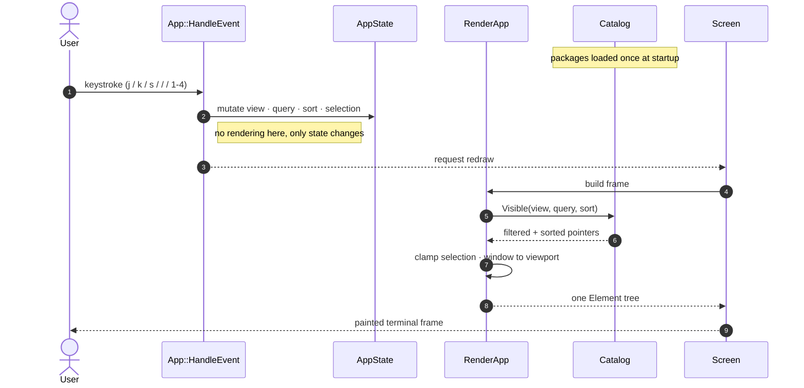

# PacSeek Architecture

A tour of how PacSeek is put together: the layers, the data flow each frame, the
rendering model, and the design decisions worth knowing before you change things.

---

## Layering

PacSeek is split into layers, each depending only on the ones beneath it. The
dependency direction is strict and one-way. Solid arrows are calls / ownership;
dashed arrows are interface implementations and token lookups.

```mermaid
flowchart TD
    CLI([" terminal · keystrokes "]):::ext

    subgraph entry [" "]
        MAIN["main.cpp<br/><i>flags · source selection</i>"]:::app
    end

    subgraph applayer ["app · owns state and the loop"]
        APP["App<br/><i>event loop · key bindings</i>"]:::app
        STATE["AppState<br/><i>view · query · sort · selection</i>"]:::app
    end

    subgraph uilayer ["ui · pure state to Element"]
        RENDER["RenderApp<br/><i>brutalist render builders</i>"]:::ui
        VLIST["PackageList<br/><i>virtualized window</i>"]:::ui
    end

    subgraph datalayer ["data · where packages come from"]
        PSRC{{"PackageSource<br/><i>interface</i>"}}:::data
        ALPM["AlpmSource<br/><i>live</i>"]:::data
        MOCK["MockSource<br/><i>offline</i>"]:::data
    end

    subgraph modellayer ["model · pure logic, no I/O"]
        CAT["Catalog<br/><i>filter · sort · counts · footprint</i>"]:::model
        PKG["Package"]:::model
    end

    THEME["theme.hpp<br/><i>every design token, named</i>"]:::theme
    LIBALPM[("libalpm<br/>pacman DBs")]:::ext

    CLI -->|input| APP
    MAIN -->|selects| PSRC
    MAIN -->|runs| APP

    APP -->|mutates| STATE
    APP -->|owns| CAT
    APP -->|draws via| RENDER
    APP -->|loads once| PSRC

    RENDER -->|reads| STATE
    RENDER -->|queries| CAT
    RENDER --> VLIST

    PSRC -.implemented by.-> ALPM
    PSRC -.implemented by.-> MOCK
    ALPM -->|reads| LIBALPM
    ALPM -->|produces| PKG
    MOCK -->|produces| PKG
    CAT -->|owns| PKG

    RENDER -.tokens.-> THEME
    CAT -.tokens.-> THEME
    PKG -.tokens.-> THEME

    classDef app fill:#24160f,stroke:#de542c,stroke-width:2px,color:#e9e7e2
    classDef ui fill:#15151a,stroke:#8a8f9a,stroke-width:1.5px,color:#e9e7e2
    classDef data fill:#13201a,stroke:#7fae8b,stroke-width:1.5px,color:#e9e7e2
    classDef model fill:#1a1a1d,stroke:#b8b6b0,stroke-width:1.5px,color:#e9e7e2
    classDef theme fill:#2a2210,stroke:#e0b341,stroke-width:1.5px,color:#e9e7e2
    classDef ext fill:#0b0b0d,stroke:#5d5d5a,stroke-width:1px,color:#9a9a95,stroke-dasharray:4 3

    style entry fill:#0e0e10,stroke:#1c1c20
    style applayer fill:#0e0e10,stroke:#1c1c20,color:#5d5d5a
    style uilayer fill:#0e0e10,stroke:#1c1c20,color:#5d5d5a
    style datalayer fill:#0e0e10,stroke:#1c1c20,color:#5d5d5a
    style modellayer fill:#0e0e10,stroke:#1c1c20,color:#5d5d5a
```



- **`theme.hpp`** is a leaf with no dependencies. Every color, threshold, and
  dimension is a named constant here so nothing downstream hardcodes a value.
- **`model/`** is pure logic with no I/O and no FTXUI dependency beyond the
  `Color` type. It is the part you can unit-test without a terminal or a system.
- **`data/`** turns a source of truth (libalpm, or the mock table) into
  `model::Package` values, behind the `PackageSource` interface.
- **`ui/`** is a set of pure functions from application state to FTXUI `Element`
  trees. It reads state; it never mutates it.
- **`app/`** owns the mutable state, the data, the screen, and the event loop. It
  is the only layer that wires the others together.

The key invariant: **the UI never knows which `PackageSource` produced its data.**
That is what makes `--mock` and the live backend interchangeable, and what keeps
the render layer trivially previewable.

---

## The domain model

### `model::Package`

The single value type the rest of the program reasons about:

```cpp
struct Package {
  std::string name, version, description;
  Repo        repo;                  // Core / Extra / Multilib / Aur / Unknown
  int64_t     install_size_bytes;    // on-disk footprint once installed
  int64_t     download_size_bytes;   // compressed download size
  bool        installed;
  bool        has_update;
};
```

Sizes are kept in **bytes** so the libalpm source can hand over native values
without lossy conversion; formatting to MiB / GiB / TiB happens only at the edge,
in `FormatSize`.

### `model::Catalog`

Owns the full `std::vector<Package>` and answers every derived question the UI
asks, all as pure functions over the owned data:

| Method | Answers |
|--------|---------|
| `Visible(view, query, sort)` | which rows to draw, as stable pointers into the owned vector |
| `CountForView(view)` | nav badge counts (whole dataset, ignores search) |
| `InstalledCountForRepo(repo)` | the REPOSITORIES legend |
| `MaxInstallSizeBytes()` | the normalizer for every impact bar |
| `TotalInstalledBytes()` / `InstalledCount()` | the footprint card headline |
| `InstalledFootprintByRepo()` | the segmented footprint bar |

`Visible` returns `const Package*` pointers rather than copies; they stay valid
for the catalog's lifetime, and the render layer only reads them.

---

## Data sources

`PackageSource` is the seam:

```cpp
class PackageSource {
  virtual std::vector<model::Package> LoadPackages() = 0;
  virtual bool        IsReadOnly() const = 0;
  virtual std::string Name() const = 0;
};
```

`LoadPackages()` may be slow (database, and later network), so the app calls it
**once** at startup and hands the result to the catalog, never per frame.

### `AlpmSource` (live)

Reads pacman's databases directly through libalpm:

1. **Initialize** a handle for `root = "/"`, `db_path = "/var/lib/pacman/"`. A
   small RAII guard guarantees `alpm_release` even on exceptions. Failure throws
   `std::runtime_error`, which `main` catches to suggest `--mock`.
2. **Read the local database** into a map of name → (version, installed size):
   the picture of what is currently installed.
3. **Discover sync repos** by scanning `db_path/sync/*.db`, ordering the
   well-known `core` / `extra` / `multilib` first so the UI is stable.
4. **Join** each sync entry against the installed map, marking `installed`, and
   setting `has_update` when `alpm_pkg_vercmp` finds the sync version newer. A
   package appearing in multiple repos keeps its first (highest-priority) listing.
5. **Append foreign packages**: anything installed but absent from every sync
   repo (AUR builds, hand-built packages) is surfaced as `Repo::Aur`, sized from
   the local database.

`BasePackage()` maps the fields common to every package; `PackageFromSyncEntry`
and `AppendForeignPackages` build on it so the mapping lives in one place.

### `MockSource` (offline)

A fixed 22-package table lifted straight from the design handoff, sizes expressed
in MiB exactly as the reference lists them. It satisfies the same interface, so
the entire UI can be exercised with no system access, handy for previews and for
iterating on the render layer.

---

## A frame, end to end

The app builds an FTXUI `Renderer` whose closure runs once per frame. Events only
ever change state; the render closure is a pure function of that state.



State lives in exactly one place (`AppState`); the render layer is a pure function
of it. There is no hidden UI state inside the components.

### `AppState`

```cpp
struct AppState {
  model::View view;          model::Sort sort;     std::string query;
  int  selected_index;       bool search_focused;
  std::string status_message;
  std::string source_name;   bool read_only;
  int64_t disk_total_bytes;  // measured once via statvfs("/") at startup
};
```

---

## The rendering model

`ui/components.cpp` is built bottom-up from small leaf builders (`SolidBlock`,
`Badge`, `RightCell`) into larger pieces (`PackageRow`, `Sidebar`, `Footer`) and
finally `RenderApp`, which composes the whole screen:

```
RenderApp
├── TitleBar
└── body (hbox)
    ├── Sidebar              fixed width; nav + legend flex, footprint card pinned
    └── main_column (vbox)
        ├── SearchBar
        ├── ColumnHeader
        ├── PackageList      virtualized (see below)
        └── Footer
```

Two layout details are load-bearing:

### List virtualization

A naïve list builds one `Element` per package. On a full system that is 15,000+
rows, and the resulting column is taller than the terminal, which defeats FTXUI's
height clamping and pushes the footer and the sidebar's footprint card off-screen.

`PackageList` instead **renders only the window of rows that fits the terminal**,
centered on the selection:

```cpp
const int viewport_rows = Terminal::Size().dimy - kListChromeRows;
const int capacity      = max(1, viewport_rows / kRowsPerPackage);
int start = clamp(selected_index - capacity / 2, 0, max(0, count - capacity));
```

This keeps the list's height bounded to the screen (so the surrounding layout
clamps correctly and the footprint card stays pinned), and it is far cheaper to
lay out: only a screenful of elements is built each frame regardless of catalog
size.

### Sidebar pinning

The sidebar is a `vbox` of `{ nav+legend | flex, separator, FootprintCard }`. The
nav/legend block flexes to fill space and push the card to the foot (clipping its
lowest rows first on a very short terminal), while the footprint card and its rule
stay anchored at the bottom. This works precisely *because* the package list is
virtualized: an unbounded list would inflate the shared row height and starve the
card.

---

## Design tokens

`theme.hpp` is the single source of truth for the look:

- **`color`**: surfaces, the Braun-orange accent ramp, the four repository
  identity colors, status tones, and assorted chrome tints, all as `Color::RGB`.
- **`size`**: the 300 MiB "heavy" threshold and the byte/MiB/GiB/TiB constants
  that drive `FormatSize` and the heavy highlight.
- **`layout`**: column widths and the storage-bar track width, in terminal cells.

If a value affects how something looks or where a threshold sits, it belongs here,
named, never inline at the call site.

---

## Extending PacSeek

- **A new data source** (e.g. a live AUR RPC client): implement `PackageSource`,
  return `model::Package` values, and select it in `main.cpp`. Nothing in `ui/`
  or `model/` needs to change.
- **A new view or sort mode**: add to the `View` / `Sort` enums and teach
  `Catalog`'s `MatchesView` / `Visible` about it; the nav and key bindings follow.
- **A visual change**: adjust a token in `theme.hpp`. If you find yourself typing
  a literal color or width in `components.cpp`, add a named token instead.
- **Transactions**: `App::TriggerActionOnSelection` is the hook. It currently
  shows a read-only notice; real install/remove (with privilege escalation) slots
  in there, gated on `PackageSource::IsReadOnly()`.
